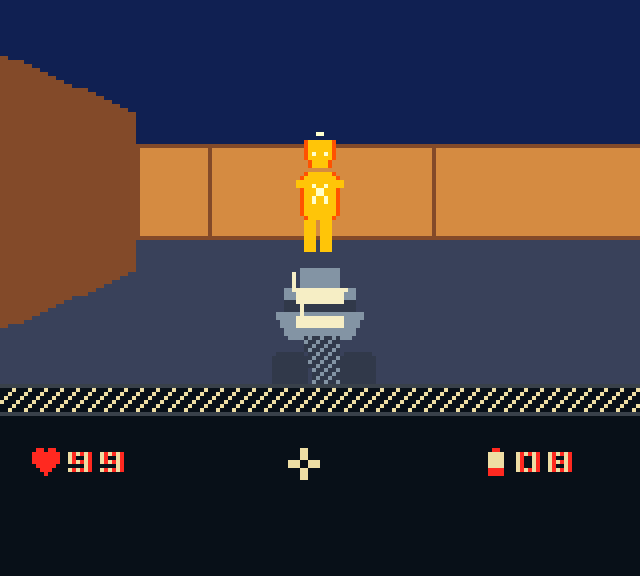
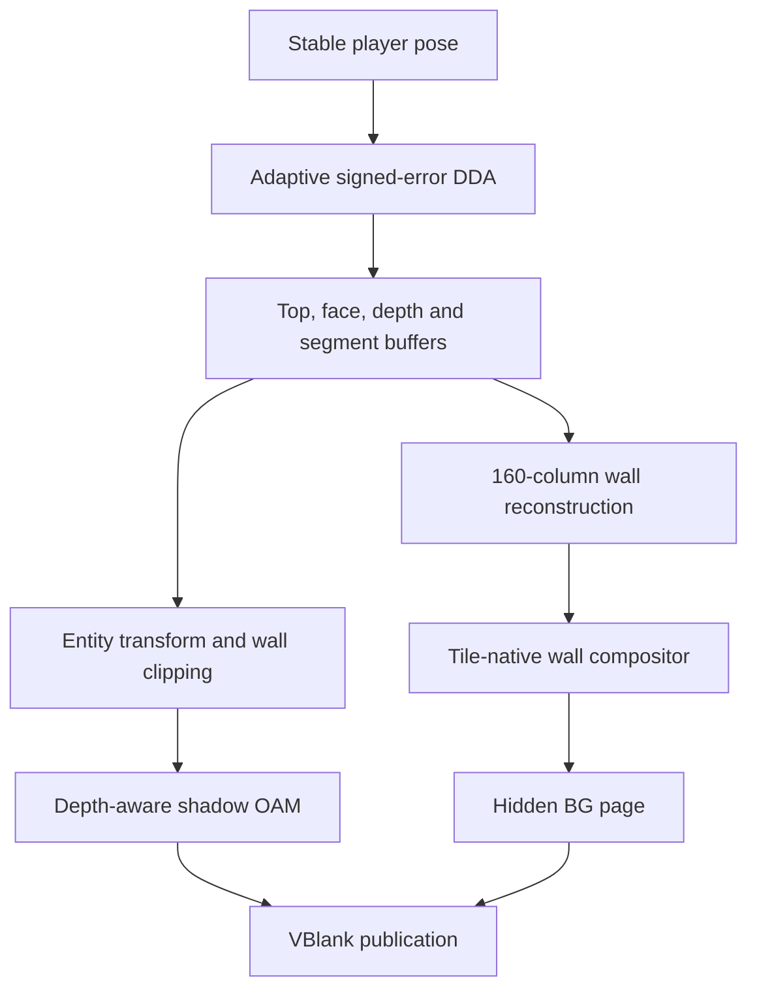

<div align="center">

# Lupine 3D

### A living first-person world on the Game Boy Color

**Exact raycasting · depth-aware entities · deterministic builds · no framebuffer**

[](https://github.com/PowerBeef/Lupine3d/actions/workflows/ci.yml)
[](LICENSE)
[](#hardware-status)

[**Build**](#quick-start) · [**Play**](#controls) · [**Architecture**](docs/ARCHITECTURE.md) · [**Verify**](#verification) · [**Develop**](docs/DEVELOPMENT.md)



<sub>160×96 viewport · 4 MiB MBC5 ROM · 34 automated tests · two driven playtest routes</sub>

</div>

---

Lupine 3D is an original, CGB-only first-person engine built around the hardware's tile renderer. The current **0.6.0 “Living World”** implementation combines coherent wall geometry with a depth-aware billboard renderer, one complete enemy, a dropped pickup, animated doors, combat, and a finishable authored level.

The cartridge runs on the double-speed SM83 and uses both VRAM banks, hidden BG pages, GDMA, OAM, VBlank interrupts, the joypad and audio hardware. There is no bitmap framebuffer, coprocessor, cartridge RAM, imported game code, or borrowed artwork.

## Current feature set

| Rendering | Living world | Platform engineering |
|---|---|---|
| 80 adaptive rays → 160 columns | Animated 16×32 Sentinel | 4 MiB MBC5, no cartridge RAM |
| Corrected Q5 wall-depth buffer | Patrol, chase, attack, hurt, death | Deterministic Python ROM builder |
| Build-time wall-segment IDs | Exact-grid line of sight | One-VBlank GDMA page publication |
| Exact boundary-tile cache | Wall-clipped size-LOD billboards | Atomic shadow-OAM DMA |
| World-anchored material grammar | Hitscan, damage, medkit and exit | VBlank-rate edge-latched input |
| Two scene-level VRAM profiles | Radius collision and moving door | Optional ±4 px turn reprojection |

### Sentinel Outpost

The included level is a deliberately small vertical slice. The Sentinel begins dormant, patrols, acquires the player through exact grid traversal, chases, attacks, reacts to hits, dies, and drops a medkit. Its death activates the exit, so the level has a complete start-to-finish combat loop rather than disconnected engine demonstrations.

The level, spawn points, door, pickup, exit, material profile, and VRAM profile are authored in [`levels/living_world.json`](levels/living_world.json) and compiled into a compact bank-friendly payload.

## Rendering architecture



Each two-pixel ray sample records projected top, style, face position, corrected perpendicular distance, and an authored continuous-surface ID. Segment identity prevents adaptive interpolation across disconnected walls; depth lets billboard strips reject themselves against the wall already occupying that screen region.

The wall compositor reuses static ceiling, floor and seam tiles, consults an exact corpus-trained boundary atlas, and generates only the remaining boundary cells. A miss is never approximate—it falls through to the exact compositor.

### Scene-level VRAM profiles

| Profile | Exact wall atlas | Freed tile IDs | Intended use |
|---|---:|---:|---|
| Renderer-heavy | 121 patterns | 0 | Maximum exact wall-cache coverage |
| Entity-heavy | 80 patterns | 41 | Sentinel frames, pickup and effects |

Both payloads coexist in ROM. The active level selects its profile during loading. Across the 24,384-view atlas corpus, the entity-heavy cache peaks at 58 generated tiles against a capacity of 96 and produces zero overflows.

### Hybrid billboard renderer

The first entity path uses normal CGB objects instead of merging actors into the BG compositor. It supports 8×16 far and 16×32 near representations, divides near billboards into eight-pixel strips, rejects each strip against `RAY_DEPTH[80]`, and submits visible strips through a 160-byte shadow-OAM image.

OAM entries 0–17 are permanently reserved for the weapon, muzzle flash and crosshair. Entities use entries 18–39. Publication is deferred when a pathological wall frame would leave insufficient VBlank budget; the next safe frame publishes the complete OAM image atomically.

## Measured behavior

The empty-world regression route contains 27 updates and nine frozen RGB captures. The Living World route contains eight updates and drives the complete combat and level-completion sequence.

| Driven result | Empty-world oracle | Living World |
|---|---:|---:|
| Mean cycles/update | **972,627** | **859,909** |
| Maximum cycles/update | **1,124,336** | **1,125,772** |
| Minimum updates/s | **7.461** | **7.451** |
| Maximum dynamic tiles | **50 / 96** | **38 / 96** |
| Maximum total ray casts | **59** | **55** |
| Maximum visible OAM entries | **18 / 40** | **26 / 40** |
| Maximum objects on one scanline | **4 / 10** | **5 / 10** |
| Unsafe GDMA starts | **0** | **0** |
| Frozen RGB captures exact | **9 / 9** | State-driven captures |

Geometry is also measured across **24,384 views** and **3,901,440 physical columns** against an independent floating camera-plane oracle.

| Geometry result | Measurement |
|---|---:|
| Mean wall-top error | **0.243 px** |
| P95 wall-top error | **0.794 px** |
| P99 wall-top error | **1.136 px** |
| Wrong visible wall segment | **0.254%** |
| Wrong material | **0.0209%** |

The retained 41-pixel maximum is a known one-column quantized-ray/float-oracle segment disagreement. The test suite preserves its pose, column, surfaces and map neighborhood. A full-corpus experiment found that a proposed boundary correction improved only one of 3.9 million columns, so it was rejected instead of adding a brittle visual heuristic.

## Quick start

Requirements: **Python 3.10+**, `make`, and Pillow. The setup script creates a local virtual environment and installs the pinned dependencies.

```sh
git clone https://github.com/PowerBeef/Lupine3d.git
cd Lupine3d
python3 tools/dev_setup.py
make qa
make preview
```

The ROM is written to `build/lupine3d.gb`.

Useful development targets:

```sh
make build                 # deterministic 4 MiB cartridge image
make test                  # 34 ROM/host differential tests
make playtest              # nine-capture exact empty-world oracle
make playtest-world        # Sentinel combat and level-completion route
make research-atlas-all    # regenerate both VRAM-profile caches
make research-tail         # preserve exceptional geometry evidence
make verify                # consolidated verification report
```

Enable the experimental VBlank turn-reprojection build with:

```sh
LUPINE3D_REPROJECTION=1 python3 tools/build_rom.py
```

It scrolls the previous 3D page by at most four pixels while a full update is rendering, uses guard tiles on both viewport edges, resets on the next exact page publication, and restores `SCX` at scanline 96 so the HUD remains stationary. It is compile-time optional pending independent emulator and original-LCD evaluation.

## Controls

| Button | Action |
|---|---|
| D-pad Up / Down | Move forward / backward |
| D-pad Left / Right | Turn |
| A | Fire |
| B | Open the door ahead |

Short button presses are sampled and edge-latched every VBlank, even during a long visual update. The renderer always sees one stable camera snapshot.

## Verification

Every push and pull request performs a deterministic ROM build, runs all 34 tests, executes both driven playtests, checks the nine RGB oracles, and retains the ROM, manifests, telemetry, and contact sheets as CI evidence.

The suite executes the generated SM83 program and verifies:

- cartridge headers, checksums, bank layout and deterministic ROM bytes;
- exact 80-ray descriptors, depth and segment buffers;
- exact 160-column reconstruction, dynamic tiles and hidden tile map;
- both exact atlas payloads and the complete authored level;
- OAM total/per-scanline limits, wall occlusion and deferred DMA;
- collision, line of sight, AI, combat, pickup, exit and animated door state;
- VBlank input latching, optional reprojection bounds and HUD reset;
- one-fresh-VBlank GDMA ordering and page alternation;
- the frozen reference-ROM hash and exceptional-tail certificate.

The harness is project-specific and cycle-aware; it is not presented as an independent emulator.

## Hardware status

The ROM is CGB-only (`$0143 = $C0`) and uses an MBC5 cartridge (`$0147 = $19`) with no external RAM. It requires support for a **4 MiB MBC5 image**, double-speed mode, both VRAM banks, GDMA and OAM DMA.

Original Game Boy Color certification has not been completed in this environment. The exact release candidate still needs to pass maintained independent emulators and an original CGB with an MBC5-capable flash cartridge. See the [hardware acceptance checklist](docs/HARDWARE_TEST_CHECKLIST.md).

## Documentation

| Document | Purpose |
|---|---|
| [Living World design](docs/LIVING_WORLD_V6.md) | Entity, level, OAM, door and reprojection architecture |
| [Architecture](docs/ARCHITECTURE.md) | Cartridge, memory, rendering and runtime layout |
| [Development harness](docs/DEVELOPMENT.md) | Build, playtest, scenario and telemetry workflows |
| [Performance engineering](docs/PERFORMANCE_V4.md) | ROM-for-compute design and measured hot-path work |
| [Research decisions](docs/RESEARCH_AND_DECISIONS.md) | Hardware research and accepted/rejected experiments |
| [Test report](docs/TEST_REPORT.md) | Automated evidence, budgets and limitations |
| [Hardware checklist](docs/HARDWARE_TEST_CHECKLIST.md) | Independent emulator and original-device procedure |

## Scope

Lupine 3D now proves a playable engine slice, not a general-purpose content suite. It has one authored 16×16 level, one enemy type, one pickup, one door and one exit. Multi-entity scenes, projectile actors, more levels and materials, animation streaming, saving, and textured floor/ceiling casting remain future work.

Code and original assets are available under the [MIT License](LICENSE). “Lupine 3D” is an independent project name; see [NOTICE.md](NOTICE.md) for the naming and asset statement.

<div align="center">

Built sideways into a living world the Game Boy Color was never supposed to draw. 🐺

</div>
