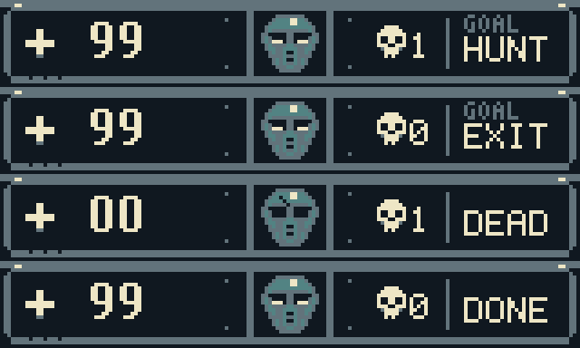

<div align="center">

# Lupine 3D

### Sable Outpost · A first-person game for Game Boy Color

[](https://github.com/PowerBeef/Lupine3d/actions/workflows/ci.yml)
[](LICENSE)

[**Download v0.8**](https://github.com/PowerBeef/Lupine3d/releases/tag/v0.8) · [Build](#build-from-source) · [Controls](#how-to-play) · [Release notes](RELEASE_NOTES.md)


<sub>160×120 world view · Animated native sprites · 4 MiB MBC5 ROM · CGB only</sub>

</div>

Explore an industrial outpost, open its sliding doors, defeat the Sentinels and reach the exit. Lupine 3D renders its first-person world with Game Boy Color tiles and hardware sprites, without a framebuffer or cartridge RAM.

**v0.8 brings the Sable visual overhaul:** an animated shotgun, red-armoured enemies, a compact steel instrument panel and a larger view of the world. The release includes the playable ROM, native art sources, generated concept masters, previews and reproducible verification evidence.

## What's new in v0.8

- **More world, less HUD.** The 24-pixel panel is half the height of beta.6's HUD. The 160×120 viewport shows 25% more world area at the same projection scale and horizontal field of view.
- **Animated equipment and enemies.** Five weapon cels, two flashes, twelve Sentinel cels at each of three sizes, and four helmet portrait states. Animation follows accepted simulation ticks and coherent frame publication.
- **A readable steel HUD.** Large health digits, an armoured portrait, a skull counting enemies remaining, and a HUNT/EXIT objective. No permanent controls footer or unsupported ammunition indicators.
- **Preserved engine contracts.** Deterministic builds, immutable render snapshots, exact wall reuse and bounded graphics publication. Legacy artwork and historical image fixtures remain available.



## How to play

Open `Lupine3D_v0.8.gb` in a Game Boy Color emulator with MBC5 support. The monochrome Game Boy is not supported. There is no save system.

| Game Boy button | Action |
|---|---|
| D-pad Up / Down | Move forward / backward |
| D-pad Left / Right | Turn |
| A | Fire the shotgun |
| B | Use a nearby door |
| Start | Restart after death or completion |

The **skull counts living enemies remaining**, not kills. **GOAL / HUNT** means clear the outpost; **GOAL / EXIT** means the exit is available. Reach it to finish. Doors still open with B. Green medical pickups restore health.

## Performance and qualification

Active 60-second scenarios measure **5.50–7.92 full geometry updates/s**. Full geometry updates and cached sprite/HUD presentations run at different rates. Animation follows the engine's coherent cadence. The target of ten sustained full geometry updates per second remains unmet.

v0.8 deliberately trades some geometry throughput for the larger viewport and animated art. The original half-gains performance criterion was not met; that visual tradeoff was explicitly accepted. Memory, graphics capacity and publication safety limits remain enforced. See the ROM-bound measurements in the [v0.8 test report](docs/TEST_REPORT.md).

Qualification uses the project harness and pinned **SameBoy CGB-0/CGB-E and mGBA** cores. It is **emulator-qualified**; physical hardware and an original Nintendo boot ROM have not been tested. Reprojection and the experimental foreground feedback lane remain disabled.

## Build from source

Requires Python 3.10+, Pillow and Make. RGBDS is not required: Python emits the console's SM83 machine code, tables, level data and 2bpp graphics.

```sh
python3 tools/dev_setup.py
source .venv/bin/activate
make build
make test
```

The build writes `build/lupine3d.gb`, symbols, a listing and `build/build_manifest.json`. Builds consume checked-in indexed PNGs and never call image generation or require an image API key.

```sh
make playtest playtest-world playtest-art
make playthrough variants wall-reuse motion
```

| Display profile | World / HUD | Default art |
|---|---|---|
| `slim` — default | 160×120 / 160×24 | Sable, animated |
| `compact` | 160×112 / 160×32 | Sable, animated |
| `legacy` | 160×96 / 160×48 | Historical, static |

For example, `LUPINE3D_DISPLAY=legacy make build` reproduces the beta.6 visual configuration. Rebuild without overrides to restore the current ROM. Project development takes place directly on `main`.

## Explore the project

| Guide | Contents |
|---|---|
| [Documentation index](docs/README.md) | Current guides and historical evidence |
| [Development](docs/DEVELOPMENT.md) | Setup, emulator cores, diagnostics and releases |
| [Architecture](docs/ARCHITECTURE.md) | Rendering, memory, simulation and publication |
| [Sable Outpost art](docs/SABLE_OUTPOST.md) | Visual language, animation sources and budgets |
| [Steel HUD](docs/STEEL_HUD.md) | Layout, objective text and native tile contracts |
| [Verification](docs/TEST_REPORT.md) | Current ROM hash, executed checks and performance |
| [Contributing](CONTRIBUTING.md) | Change requirements and development policy |
| [Agent guidance](AGENTS.md) | Code map and implementation invariants |

Original code and assets use the [MIT License](LICENSE). See [NOTICE.md](NOTICE.md) for attribution and asset provenance.
