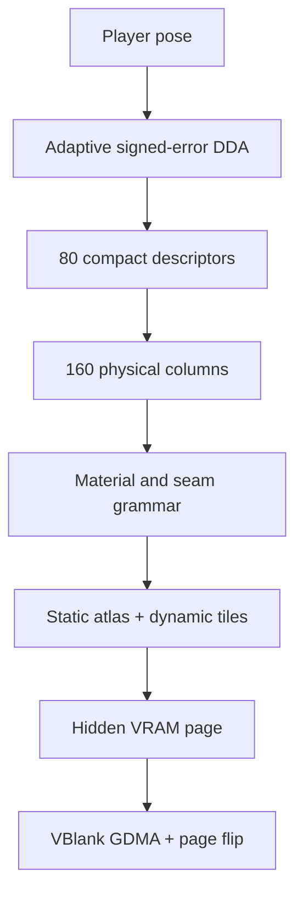

<div align="center">

# Lupine 3D

### A real-time first-person engine for the Game Boy Color

**Deterministic · framebuffer-free · engineered for real CGB hardware**

[](https://github.com/PowerBeef/Lupine3d/actions/workflows/ci.yml)
[](https://github.com/PowerBeef/Lupine3d/releases/latest)
[](https://github.com/PowerBeef/Lupine3d/releases)
[](LICENSE)
[](#hardware-status)

[**Download**](https://github.com/PowerBeef/Lupine3d/releases/latest) · [**Build**](#quick-start) · [**Architecture**](docs/ARCHITECTURE.md) · [**Renderer**](docs/RENDERER_V3.md) · [**Contribute**](CONTRIBUTING.md)


<sub>160×96 viewport · 4 MiB MBC5 ROM · 25 automated tests · nine exact visual oracles</sub>

</div>

---

Lupine 3D is an original raycasting engine that turns the Game Boy Color's tile renderer into a coherent first-person world. It targets the real SM83 CPU, CGB VRAM banks, GDMA, OAM, joypad, and audio hardware—without a framebuffer or coprocessor.

Version **0.4.0** preserves the v0.3 renderer pixel-for-pixel while cutting the driven renderer's mean cost by **18.61%** through an HRAM hot-state ABI, an exact boundary-tile atlas, and banked MBC5 arithmetic tables.

> Inspired by the early-1990s corridor-shooter format, but built from original code, artwork, maps, sounds, and names. No Wolfenstein 3D assets or source are included.

## At a glance

| Engine | Rendering | Verification |
|---|---|---|
| CGB double-speed SM83 | 160×96 first-person viewport | 25 automated tests |
| 4 MiB MBC5, no cartridge RAM | 80 adaptive samples → 160 columns | Nine exact RGB capture oracles |
| Fixed-point signed-error DDA | Directional materials and face seams | 27-update driven playtest |
| One-fresh-VBlank page commit | Hybrid static/dynamic tile compositor | Frozen v0.1 ROM hash |

### What makes it unusual

- **Adaptive geometry** — 41 mandatory ray anchors, safe midpoint reconstruction, and exact fallback casts at discontinuities.
- **Coherent materials** — side-aware lighting, world-anchored seams, door frames, contact shadows, and projected-height LOD without expensive arbitrary textures.
- **Tile-native composition** — static ceiling, floor, seam, and exact boundary-atlas tiles are reused; only the remaining boundary cells are generated.
- **Banked exact arithmetic** — exhaustive projection and DDA product tables trade plentiful MBC5 ROM space for scarce CPU cycles without changing a pixel.
- **Atomic presentation** — the hidden tile page and map are committed during one fresh VBlank, then flipped only after both GDMA transfers finish.
- **Executable evidence** — the harness runs the emitted SM83 program, models bank switching and GDMA, drives the controls, and renders final BG/OBJ pixels.

## Performance and fidelity

### v0.4 performance

Measured over the same 27-update driven coherence route and frozen capture poses:

| Measurement | v0.3.0 | v0.4.0 | Change |
|---|---:|---:|---:|
| Mean cycles/update | 1,118,243 | **910,143** | **−18.61%** |
| Maximum cycles/update | 1,264,820 | **1,124,736** | **−11.08%** |
| Minimum updates/s | 6.632 | **7.458** | **+12.45%** |
| Exact capture pixels | reference | **9 / 9** | unchanged |

The route reaches at most 54 dynamic tiles and 59 casts, records zero unsafe GDMA starts, and stays within the 120-block single-VBlank cap.

### v0.3 geometry retained by v0.4

The stress corpus covers **24,384 views** and **3,901,440 physical columns** against an independent floating camera-plane oracle.

| Measurement | v0.2.2 | v0.3/v0.4 |
|---|---:|---:|
| Mean wall-top error | 0.334 px | **0.243 px** |
| P95 wall-top error | 1.256 px | **0.794 px** |
| P99 wall-top error | 1.953 px | **1.136 px** |
| Wrong visible wall segment | 0.384% | **0.256%** |
| Wrong material | 0.0322% | **0.0209%** |

These are project-harness and mathematical results—not original-hardware certification.

## Quick start

Requirements: **Python 3.10+**, `make`, and Pillow (installed by the setup script).

```sh
git clone https://github.com/PowerBeef/Lupine3d.git
cd Lupine3d
python3 tools/dev_setup.py
make qa
make preview
```

The playable ROM is written to `build/lupine3d.gb`. To produce the complete verified release bundle:

```sh
make package
```

<details>
<summary><strong>Run each verification stage directly</strong></summary>

```sh
.venv/bin/python tools/build_rom.py
.venv/bin/python -m unittest discover -s tests -v
.venv/bin/python tools/playtest.py
.venv/bin/python research/rendering_v3_lab.py
.venv/bin/python tools/release_check.py
```

</details>

## Controls

| Button | Action |
|---|---|
| D-pad Up / Down | Move forward / backward |
| D-pad Left / Right | Turn |
| A | Fire, with pulse-channel sound and muzzle flash |
| B | Open the door directly ahead |

## Rendering pipeline



The viewport is represented by 80 compact `{top, style, face, along}` descriptors. Quarter-interval synthesis reconstructs 160 physical columns, with exact recasts beside detected face discontinuities. The compositor then classifies the 20×12 viewport cells, reuses exact atlas matches, generates only the remaining boundary tiles, and commits a 384-byte hidden tile map atomically.

<details>
<summary><strong>Renderer feature inventory</strong></summary>

- 1,024-direction quantized render-vector table
- Camera-plane-correct field-of-view offsets and fish-eye correction
- Exact signed-error grid DDA with no general division in the traversal loop
- Q5 distance projection through an exhaustive banked-ROM result table
- Correct X/Y wall-side identity with directional light and shadow styles
- Quarter-interval synthesis with exact recasts at face discontinuities
- World-anchored face creases and along-cell seams
- Projected-run door frames, centre spine, and material LOD
- One-row top lip and floor-contact shadow on silhouette tiles
- Exact boundary atlas with 255 signatures and 121 mirrored VRAM tiles
- Hybrid one-/two-pixel boundary microstrips and a dynamic tile dictionary
- Maximum 96 generated boundary tiles per frame
- Separate CGB tile-data banks for the two visible pages

</details>

## Development and verification

Every push and pull request builds the deterministic ROM, runs the full regression suite, executes the driven playtest, and checks the exact pixel oracle in GitHub Actions. CI retains the ROM, build manifest, telemetry report, and contact sheet as downloadable artifacts.

The project deliberately keeps several independent anchors:

- the exact v0.1.0 ROM SHA-256 oracle;
- frozen v0.3.0 RGB pixels at nine capture poses;
- independent geometry/material research models;
- structural checks for cartridge layout, MBC5 banks, LUTs, GDMA safety, and tile reconstruction;
- clean-room rebuilds of both published archives.

The frozen v0.1.0 generator remains in `tools/build_rom_v1.py`; its oracle ROM SHA-256 is `0b5794c93b43b38a0dd2a76cf4e289f0317dd9b10314632ff366402ecd37fa00`.

## Hardware status

The ROM is CGB-only (`$0143 = $C0`) and uses MBC5 (`$0147 = $19`) with no cartridge RAM. Run `build/lupine3d.gb` in a CGB-capable emulator, or copy it to a flash cartridge that supports **4 MiB MBC5** images.

Original Game Boy Color testing has not yet been completed in this environment. Independent emulator validation and a flash-cartridge run are still required before the engine is called hardware-certified; see the [hardware test checklist](docs/HARDWARE_TEST_CHECKLIST.md).

## Documentation

| Document | Purpose |
|---|---|
| [Architecture](docs/ARCHITECTURE.md) | Cartridge, memory, renderer, and runtime layout |
| [v0.4 performance](docs/PERFORMANCE_V4.md) | Optimization plan, experiments, and measured checkpoints |
| [v0.3 renderer](docs/RENDERER_V3.md) | Geometry reconstruction and material pipeline |
| [Development harness](docs/DEVELOPMENT.md) | SM83 execution, playtest scenarios, captures, and telemetry |
| [Research decisions](docs/RESEARCH_AND_DECISIONS.md) | Hardware research and accepted/rejected techniques |
| [Hardware checklist](docs/HARDWARE_TEST_CHECKLIST.md) | Emulator and original-device validation procedure |
| [Test report](docs/TEST_REPORT.md) | Current automated evidence and limitations |

## Current scope

Lupine 3D is an engine demonstration rather than a complete game. It already includes movement, turning, collision, doors, firing, HUD, weapon, crosshair, muzzle flash, and sound. Enemy/entity rendering, AI, damage, pickups, level progression, animated doors, floor/ceiling texture casting, and saving remain future work.

The demo's enclosed 16×16 map lives in `make_map()` in `tools/build_rom_v1.py`; values `1` and `2` are wall materials, `3` is an openable door, and `0` is empty space.

## License

Code and original assets are available under the [MIT License](LICENSE). “Lupine 3D” is an independent project name; see [NOTICE.md](NOTICE.md) for the full naming and asset statement.

<div align="center">

Built sideways into something the Game Boy Color was never supposed to do. 🐺

</div>
