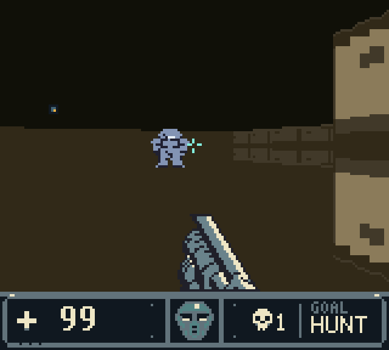
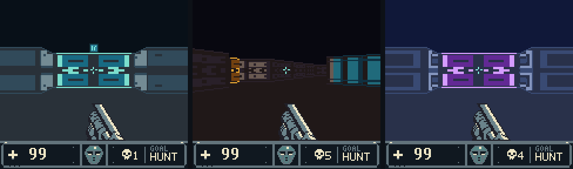

<div align="center">

# Lupine 3D

### A first-person 3D engine for the Game Boy Color

[](https://github.com/PowerBeef/Lupine3d/actions/workflows/ci.yml)
[](LICENSE)

[**Make a game**](docs/tutorials/first-game.md) · [Handbook](docs/README.md) · [Showcase: Sable Outpost](games/sable_outpost/README.md) · [Release notes](RELEASE_NOTES.md)


<sub>160×120 textured world · animated sprites · 4 MiB MBC5 cartridge · Game Boy Color only</sub>

</div>

Lupine 3D turns a folder of levels, art, music and text into a Game Boy Color
cartridge that plays a first-person game: textured walls, sliding doors,
enemies that hunt you, weapons, a HUD, music and a campaign. The console has
no framebuffer and 32 KiB of work RAM; the engine composes every frame from
tiles and sprites and streams it to video memory while the player moves.

The engine is written in Python. It emits the console's SM83 machine code,
its tables and your game's data into one deterministic ROM, with no
assembler or C toolchain to install. Every frame the ROM draws is checked
against a Python model of what it must be, and the result is tested in two
independent emulators.

## What the engine does

| | |
|---|---|
| **Renderer** | 160×120 first-person view over a 24-pixel HUD; walls textured from 16×8 images with depth shading; sliding doors; wall fixtures; enemies as animated sprites at three distances |
| **World** | 16×16 grid levels with up to 6 doors, 6 enemies and 16 wall fixtures; enemies that wake, patrol, chase and strike; keycards and medkits; a fixed-tick simulation |
| **Game** | up to 20<!-- limit:levels --> levels in 3<!-- limit:episodes --> episodes; 4<!-- limit:kinds --> enemy kinds; 4<!-- limit:weapons --> weapons unlocked as you progress; 4<!-- limit:themes --> themes over 7<!-- limit:textures --> wall textures; title, results and episode screens; three skills; continue codes instead of saves |
| **Sound** | a three-channel music sequencer and nine sound effects on the fourth channel |
| **Tools** | one command line (`lupine`): scaffold a game, check it, build it, play it in the harness, compare it against approved pictures, convert levels to and from Tiled |
| **Proof** | a certificate for every level, a host model for every frame, golden images for what people approved, a controller-only playthrough of every game, and two pinned emulator cores |

## Make a game in five commands

```sh
python3 tools/dev_setup.py && source .venv/bin/activate   # Python 3.10+, Pillow and numpy
python tools/lupine.py new-game games/my_game               # a copy of the starter game, renamed
python tools/lupine.py game check --game games/my_game      # every file, every limit, every level certified
python tools/lupine.py build --game games/my_game           # build/games/my_game/lupine3d.gb
python tools/lupine.py run --game games/my_game --snapshot-mode record   # every frame checked
```

Open `build/games/my_game/lupine3d.gb` in any Game Boy Color emulator. Then
follow [your first game](docs/tutorials/first-game.md): thirty minutes from
the starter to a game of your own, played through to its ending.



A game is data: a `game.json` naming its levels, enemy kinds, weapons,
themes, textures, sprites, screens and songs, all in its own folder
([game manifest](docs/reference/game-manifest.md)). The
[starter](games/starter/README.md) is the smallest complete one, and CI
builds it, plays it to its ending and restarts it on every change.

## The showcase: Sable Outpost



[Sable Outpost](games/sable_outpost/README.md) is a first-person shooter
in eighteen sectors: a relay outpost on a black moon heard something, its
security frames turned, and you go in to cut the uplink - from the outpost's
decks down into the reactor and up the signal spire. Every room holds a
fight, a card, ammunition, armour or a trap; Wardens shoot, an Overseer
holds the end of each episode, and what you carry comes with you. Four
weapons, three themes, a story told across 27 screens and eight songs. It
is the game the engine's evidence is recorded on, and it uses everything a
game can. [Download Sable Outpost v0.13](https://github.com/PowerBeef/Lupine3d/releases/tag/v0.13)
(`SableOutpost_v0.13.gb`) or build it with `python tools/lupine.py build` (the showcase is the
default game).

## Documentation

The [handbook](docs/README.md) is organised by what you need:

- **[Tutorials](docs/tutorials/README.md)**: your first game, your first level, your first engine change.
- **[How-to guides](docs/how-to/README.md)**: levels, enemies, weapons, themes, textures, sprites, screens, music, testing, debugging, shipping.
- **Reference**: the [game manifest](docs/reference/game-manifest.md), [level format](docs/reference/level-format.md), [limits](docs/reference/limits.md), [command line](docs/reference/cli.md), [palettes](docs/reference/palettes.md) and the rest.
- **Explanation**: [the engine and the game](docs/explanation/engine-and-game.md), [the hardware](docs/explanation/hardware.md), [architecture](docs/explanation/architecture.md), [textured walls](docs/explanation/textured-walls.md), [verification](docs/explanation/verification.md), [performance](docs/explanation/performance.md).
- **[Engine development](docs/engine/README.md)**: for changing the engine itself; [AGENTS.md](AGENTS.md) holds every contract.

## Status

The engine is **emulator-qualified**: the host harness and the pinned
SameBoy (CGB-0 and CGB-E) and mGBA cores pass on every build, including 87
frozen scenes compared across all three. It has not been tested on physical
hardware or with an original boot ROM. On the showcase, full geometry
updates run at 7.1 to 9.9 a second over sixty-second replays; sprites and
the HUD update between them ([performance](docs/explanation/performance.md)).
The released version is [v0.12](RELEASE_NOTES.md), the first released
under the showcase's own name.

## Build from source

Requires Python 3.10 or later, Pillow and Make. Nothing else: Python emits
the machine code, tables, level data and 2bpp graphics.

```sh
python3 tools/dev_setup.py
source .venv/bin/activate
make build        # the showcase: build/lupine3d.gb, .sym, .map, .lst, build_manifest.json
make test         # the engine's regression suite
make build GAME=games/starter
```

`python tools/lupine.py ci` runs every CI lane locally before a push
([development](docs/engine/development.md)).

## License

Original code and assets use the [MIT License](LICENSE). See
[NOTICE.md](NOTICE.md) for attribution and asset provenance.
