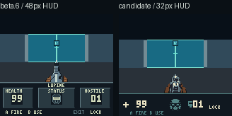
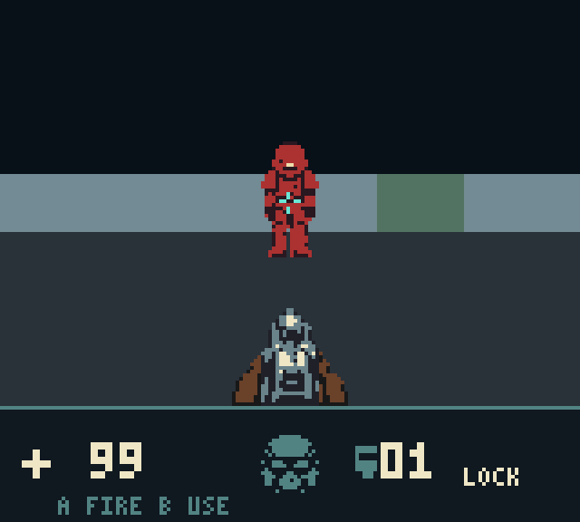

# Initial 32-pixel Sable Outpost candidate

> Historical implementation record for the initial 32-pixel HUD/Sable candidate. For the shipped v0.8 layout and budgets, see [Sable Outpost](SABLE_OUTPOST.md) and [architecture](ARCHITECTURE.md).

**Historical qualification:** the current production defaults and 16-pixel HUD
are documented in [SLIM_HUD.md](SLIM_HUD.md). The owner subsequently accepted
the visual/performance tradeoff. Measurements below describe the original
candidate and retain its failed promotion outcome; they have not been rewritten.

The opt-in candidate combines a 160×112 world, a 160×32 instrument strip,
image-generated designs adapted into native indexed sprites, and cosmetic
animation. At the time of this qualification the default remained the beta.6 display/art
configuration because the original performance gate failed. This is development evidence,
not a newly published release. Physical hardware is unavailable.

## Build and inspect

```sh
LUPINE3D_DISPLAY=compact LUPINE3D_ART=sable-v2 .venv/bin/python tools/build_rom.py --output-dir build/compact
```

The candidate ROM, symbols, listing and manifest are written to
`build/sable-v2/rom/`. At qualification time normal `make build` emitted the legacy ROM in
`build/`; current defaults have changed. The selectors are independent:

| Variable | Values | Default |
| --- | --- | --- |
| `LUPINE3D_DISPLAY` | `legacy`, `compact` | `legacy` |
| `LUPINE3D_ART` | `legacy`, `sable-v2` | `legacy` |
| `LUPINE3D_ART_ANIMATION` | `0`, `1` | `1` for new art, otherwise `0` |

New art/compact display require fixed simulation and reject experimental
foreground publication and reprojection. Flags are resolved in a fresh
process. Animation can be disabled without replacing the new sprite sources.
The compact HUD layout follows the display selector, so viewport qualification
can retain the legacy weapon and enemies.

## Native sources and design

`assets/sable_v2/masters/` preserves the generated concept, Sentinel, weapon and
portrait masters plus their exact prompts. `assets/sable_v2/native/` contains
indexed PNG sheets, including a static HUD panel with blank dynamic slots.
`assets.json` owns palette indices, dimensions, frame names, anchors, tick
intervals and source hashes. The native images are the build inputs;
`tools/lupine3d_v4/sprite_assets.py` validates and compiles them to 2bpp. Builds
never invoke generation. `tools/adapt_sable_art.py` records the offline crop,
quantization, baseline and small-LOD cleanup decisions used for these sources.

All OBJ sources use index-zero transparency and three opaque colours. Actual
VRAM palette selection remains explicit: weapon steel, outer gloved strips,
red armour, teal reticle and warm flash. The generated concept's detailed
corridor is illustrative; existing environment art and atlas bytes remain.

The instrument strip uses a health cross and two large digits, a 16×16 helmet,
a hostile symbol/count and literal LOCK/OPEN/DEAD/DONE status. A startup hint
expires after 180 accepted ticks. B USE appears when the snapshot's interaction
probe reaches a door; it does not open a door or consume input. The HUD has one
top divider, no permanent headings, and no unsupported counters or meters.

The source-sheet GIFs use an inspection cadence and an explicitly nominal
100 ms/cel preview. Actual game cadence is recorded separately:

```sh
LUPINE3D_DISPLAY=compact LUPINE3D_ART=sable-v2 .venv/bin/python tools/preview_sable.py
LUPINE3D_DISPLAY=compact LUPINE3D_ART=sable-v2 .venv/bin/python tools/preview_sable.py \
  --scene combat --output-dir build/sable-v2/combat-motion
```

These produce native/4× GIFs with measured presentation durations, rounded to
GIF's 10 ms timing resolution, and a cycle/tick log. Scene setup is diagnostic;
all subsequent input is controller-driven. Inspection GIFs deliberately slow
those same captured frames.

## Display and publication contracts

Compact mode uses horizon 56, fourteen tile rows, seven folded composition
rows, and the STAT addressing switch at line 112. Projection scale and
horizontal FOV stay fixed. Absolute decoration-height thresholds move with the
horizon so door seams and creases retain their world-distance cutoffs.
Unclipped scenes preserve their central 96 world pixels. Near clipping can
change adaptive reconstruction beside clipped rays; those scenes use the Q5
reference and independent rational plane witnesses instead of a crop oracle.

Both staging buffers grow to 448 bytes. Map data occupies $C600–$C7BF;
unfolded diagnostic scratch moves to $C7C0–$C7CF. Attributes occupy
$DC00–$DDBF. These ranges, snapshot lifetimes and the fixed-ROM/resident ceilings
are checked by the allocation ledger.

The original twelve rows retain 24-block DMA transfers. Two extra rows per
map/attribute plane use fixed-ROM, unrolled 64-byte CPU copies to hidden maps.
Dynamic patterns upload first. When combined dynamic/mask patterns exceed 72,
the map-row CPU copy and masked patterns wait for another VBlank. A final
VBlank copies the extra attributes, uploads the original map/attribute spans,
and commits HUD/OAM/page ownership. Thus compact full packets use two VBlanks,
or three under high pressure. Cached wall presentations retain their separate
single-VBlank path. The total ceiling remains 176 blocks; first-stage DMA never
exceeds 96 blocks. CPU copies and final publication must finish before line153.

Atlas payloads are unchanged. Compact metadata translates legacy signature
rows/tops by eight and deterministically rebuilds hash buckets. Each translated
signature is checked against its original pattern. Newly visible/near-clipped
signatures that have no exact entry use the compositor.

## Animation and allocation

| Resource | Candidate ownership |
| --- | --- |
| Bank-1 OBJ $8200–$86FF | Five 32×32 shotgun cels, 80 patterns |
| Bank-1 OBJ $8700–$875F | Reticle and two flashes, six patterns |
| Both OBJ banks $8000–$81FF | Existing 32-pattern masked world pool |
| Bank-0 HUD | 62 patterns, within the 96-pattern allowance |
| Cold entity source dictionary | 242 patterns, separate from resident VRAM IDs |
| WRAM1 $D3D8–$D3ED | 22-byte prepared HUD packet |
| Copied world $D77A–$D786 | Accepted shot/hurt/hint clocks and actor reaction scratch |
| Actor-record bytes 12–15 | Reaction tick, kind and reserved byte |

The four actor records and existing 457-byte snapshot spans are unchanged in
size. Boot initialization explicitly clears cosmetic clocks before reading
them, including on cores with nonzero power-on RAM. Reload resets ownership. Terminal gameplay ticks clear reaction ownership before a full 16-bit wrap can replay it; pending flashes retain their existing acknowledgement rule.

Walking uses eight-tick phases; idle changes every 32 ticks. Attack/hurt
reactions last eight ticks. Accepted firing restarts the shotgun clock, and a
pending flash forces visible recoil even when a slow frame outlives the clock.
The weapon changes OAM references; no weapon-pattern uploads occur at runtime.

Death takes effect immediately for gameplay, pickups and the exit. Three
cosmetic poses cover 36 accepted ticks. Living actors, pickups and the exit
submit before dying visuals. Actor strips preflight as a transaction, fall back
to smaller LODs if needed, and otherwise disappear together. Distance LOD
history is preserved. Four world objects per scanline, sixteen world objects
and 32 masked patterns remain the default limits.

## Qualification

`tools/check_sable.py` checks every translated atlas entry, all 36 emitted enemy
cels, cold-bank contents, tick wrap, rapid shot restarts, pending flashes,
snapshot/reload ownership, atomic capacity fallback, all map rows and both CPU
and DMA publication windows. `tools/check_display.py` launches independent
legacy/compact processes for the central-view comparison. Historical beta.6
fixtures and its ROM remain untouched.

The independent witness corpus adds 36 frozen animation/LOD scenes. Exact RGB
comparisons use identical frozen snapshots; normal controller smoke remains
unpatched. This avoids treating different portrait sampling times as a
rendering defect. SameBoy CGB-0/E and mGBA are pinned as documented in
[DEVELOPMENT.md](DEVELOPMENT.md); mGBA's adapter does not instrument DMA writes.

```sh
make PYTHON=.venv/bin/python sable-sustained
```

Each scenario runs for 60 emulated seconds. Independent host processes shorten
qualification time; only emulated CPU T-cycles are measured. The quality gate
uses the original 466bd097 baseline and accepted beta.6 performance evidence:
`Q <= (B + P) / 2` for both mean and p95, separately for every scenario. Enlarging
the viewport does not reset those references. See the retained candidate
results for the enable/disable outcome; do not promote based solely on visual
or emulator correctness.


## Measured outcome

**Implemented, opt-in; performance promotion rejected.** The candidate passes
its correctness, allocation and publication checks, but all eight sustained
scenarios exceed both original quality limits. Moving scenarios deliver
5.62–7.92 full geometry updates/s. The ten-update target is not met.

| Scenario | Candidate mean / limit (ms) | Candidate p95 / limit (ms) |
| --- | --- | --- |
| Walking | 156.7 / 140.9 | 167.4 / 150.7 |
| Turning | 126.0 / 106.6 | 150.7 / 125.6 |
| Walking + turning | 132.6 / 112.5 | 150.7 / 134.0 |
| Moving fire | 132.6 / 112.4 | 150.7 / 134.0 |
| Open door movement | 166.3 / 148.8 | 167.4 / 159.1 |
| Closed door movement | 141.8 / 119.2 | 150.7 / 134.1 |
| Two-actor corner | 178.0 / 156.9 | 234.4 / 209.3 |
| Door interaction | 154.1 / 135.7 | 184.2 / 159.1 |

The door-interaction trial is mostly stationary after opening; its cached
presentations are not counted as full geometry throughput. Values above are
full-frame CPU T-cycles converted at 8,388,608 cycles/s. The limit is the
original `(B + P) / 2`, not the accepted performance build alone.

Candidate SHA-256:
`20273801b51ba7188d6d55d3b7a653cac4697883b98d18e5ea88ed703c0e2134`.
It retains 3,891 resident bytes free, 1,936 fixed-ROM bytes free and uses 12,298
bytes of its cold asset bank. Compared with beta.6, resident allocation grows
2,048 bytes and the cold bank grows 2,784 bytes. The stack, snapshot-copy span,
OAM and mask capacities are unchanged.

The 139-test full regression run passed, including the emitted-art and
fresh-process display checks. Legacy routes retain the
historical nine-image oracle. The candidate has its separately reviewed
`playtests/sable_v2_capture_pixels.json`; folded, unfolded, scalar setup and
forced-full frozen captures agree. Controller-only completion/restart passed.
SameBoy CGB-0/E and mGBA agree with the harness for 87 frozen scenes, including
36 animation/LOD witnesses. SameBoy also reports zero unsafe CPU map writes,
visible-world map writes, unsafe DMA/OAM starts and unsafe presentations.

The geometry-tail scan covers 3,901,440 columns across 24,384 views of the
renderer benchmark level. Maximum wall-top error against the floating reference
is 4.49 pixels, with no columns reaching the eight-pixel threshold. It retains
67 segment and three material disagreements, matching the legacy scan; this
art/display change does not claim to correct those quantized-geometry cases.
See [the full tail evidence](../milestones/sable-v2/geometry-tail.json).

See [retained checks](../milestones/sable-v2/checks.json),
[independent cores](../milestones/sable-v2/independent.json),
[controller route](../milestones/sable-v2/controller.json), and the
[quality budget](../milestones/sable-v2/quality-budget.json). Portable summaries
preserve the original B/P values and source-report hashes; the raw original
reports are additionally retained under `.render-baselines/art-beta6/quality-inputs/`.
Re-evaluate a candidate with `tools/sable_quality_budget.py`; exit status1 means
the budget failed and must not be treated as permission to enable it.





The initial candidate bundle was produced by `tools/package_sable_candidate.py`.
It uses the source allowlist, rebuilds legacy and compact profiles in a clean
source copy, verifies archive payload hashes, and includes the ROM, native
sources, generated masters, previews and selected evidence. It does not create
a release, change VERSION, publish, or replace the default ROM.
