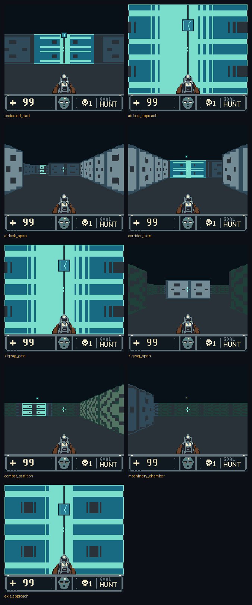

# Textured walls: design, contract and prototype gate

Lupine 3D's walls have been flat two-tone surfaces with composed edge
strips since v0.2. This document is the design for texture-mapped walls
with depth shading on the same renderer, the exact host reference that
defines what every textured tile byte must be, and the host-side prototype
that decided whether the console kernel is worth emitting. It began as the
pre-emission design; the kernel (Phase 2b) is now the renderer of every slim
build, and the sections below record the design, the gate, the emission and
its cost.

## What the folded compositor allows

The slim viewport composes eight tile rows and displays the lower seven as
the Y-flip mirror of the upper ones (palette 2 turns colour 0 into floor).
A texture therefore **cannot be vertically asymmetric**: the rows below the
horizon are the rows above it, reflected. Textures are authored **16 texels
wide by 8 rows** and mirrored about the horizon by construction; a texture
that is not is refused at compile time. Rivet rows, rails and panel seams
read naturally under that rule; a texture with a "top" and a "bottom" does
not exist here.

Wall tones are the three non-zero colours of the face's palette: 2 (lit),
3 (shaded) and 1 (the deep tone the upper palettes share with the floor).
Colour 0 is the outside. Per-face palette selection (structure, machinery,
door) is unchanged, so material colour stays a property of the face and the
texture gives shape and tone within it.

## The reference (`tools/lupine3d_v4/texture_reference.py`)

**Along-face coordinate.** Every cast now records `along_q8`: the hit's
position along the face it struck, Q8 within the cell, measured along the
axis the face is parallel to (`reference.py`, `ReferenceRayHit.along_q8`).
It is the exact rational hit point floored, for regular faces and door
panels alike. Physical pixels take it by the same reconstruction the tops
use (`expand_pixel_u`): each pair ray's two pixels are pulled a quarter of
the way towards the neighbouring ray when both lie on the same face and the
coordinates do not wrap; the pixels an edge recast replaced take the
recast's own coordinate. Faces are oriented (`face_texel_column`) so the
texture column never decreases from the viewer's left to right on any side
of a cell, which the tests assert over the corpus.

**Height classes and rows.** A tile column's eight pixels share one height
class: the tallest top within two rows of the first pixel's. `texel_row`
maps a screen row of the upper half to one of the eight texture rows; the
lower half mirrors. Silhouettes stay per-pixel exact; only texture sampling
shares the class.

**Shade.** The dark side of a cell (style bit 0) uses shade set 3; the lit
side uses near, mid or far by half height (≥ 24, ≥ 10, else). A shade set
is a tone remap applied to texels, so depth shading costs no CPU and no
palette, and its banding follows wall geometry column by column rather than
screen rows (the screen-space palette ladder v0.8 rejected). The ladder
follows each palette's brightness: structure and machinery palettes run
colour 1 darkest, 3 mid, 2 light, and far or dark-side texels step 2 -> 3
-> 1; the door palettes run 1, 2, 3 (mint on teal, yellow on orange, lilac
on purple), so a door's light tone falls to its base colour and the base
stays (`SHADE_REMAP_LIGHT_THREE`), where the shared ladder used to make far
doors brighter and invert them.

**Texture design.** A texture is the upper half of a 16×16 face, mirrored
at the horizon, and the view samples it at 1/8 to 2 texels per pixel, so
what reads is large: panels, seams and bands at least two texels across,
never single dots alone. The set shares one grammar: a dark trim along the
top (and, mirrored, the bottom) of every face, panels whose seams meet
the neighbouring face's to make a two-texel joint, and a centre feature the
mirror doubles at eye height (the outpost's panel seam, the door's and the
reactor plate's hazard chevrons, the spire's rib). The PNGs under
`assets/textures/` are the source of record, drawn with indices 1..3 only.

**Two compositions, one result.** `compose_pixels` is the semantics: for
every wall pixel, which texel, which shade. `compose_windows` is what the
console will run: inside one tile column the texture columns are affine,
`u_i = u0 + i·Δ` with Δ ∈ {1/8, 1/4, 1/2, 1, 2} texels per pixel and `u0`
quantised to a quarter texel, so a tile row is one lookup in a **row
window** table `W[texture][shade][Δ][phase][v]` (eight texels, two plane
bytes) masked by the silhouette. A face seam inside a tile column splits it
into runs, one lookup each. `affine_columns` states the approximation
exactly, and the two compositions must be byte-identical on every scene;
the emitted kernel is checked against this the way `render_view` is checked
against `reference_compose_view`.

**Costs.** A window table is 20 KiB per texture (4 shades × 5 strides × 64
phases × 8 rows × 2 bytes); the V lookup is 3.9 KiB; a 128×128 quotient
table for the console's along-face division is 16 KiB.

## The prototype gate (`research/textured_walls_lab.py`)

The lab composes 700 poses — the frozen witness scenes, the 53 wall-reuse
scenes, the tour and living-world captures, and every eighth update of the
six-sector controller route — with three procedurally authored textures
(a riveted steel panel, a machinery grille, a door plate), proves the two
compositions equal, counts patterns, and models the kernel's T-cycle cost
against the flat compositor's on each pose's measured per-update cycles.

| Criterion | Target | Measured |
| --- | --- | --- |
| Row windows equal pixel-level composition | every scene | 700 of 700 |
| Modelled Δ per full update, mean | ≤ +70k T | **+2.0k T** |
| Modelled Δ, p95 | ≤ one interval (140,448 T) | 105k T (max 135k) |
| Modelled LCD intervals, net over the corpus | ≤ +2% | **+0.34%** (4,114 → 4,128) |
| Unique patterns per update, p95 / max | ≤ 114 / ≤ 224 | **63 / 85** (160 wall tiles composed at most; identical tiles share a pattern) |
| ROM for tables | ≤ 160 KiB | 82 KiB for three textures (the per-episode sets now use 140 KiB of windows, `Texture sets per episode`) |
| Overflow | none | none |

Where the cycles come from: a textured frame composes every wall tile
(79.7 on average, 21.9 of them silhouette boundaries, 5.7 with a face seam)
at a modelled 700 T for an interior tile and 1,300 T for a boundary tile,
plus about 9.4k T to derive the coordinates; the flat compositor it replaces
composes 11.6 dynamic tiles at 6.7k T and looks up 8.2 atlas tiles. Simple
frames get cheaper; wall-filling frames pay up to one LCD interval. The
projection for the sustained scenarios, from the mean, is unchanged rates;
the honest expectation is a small loss on wall-heavy motion and none
elsewhere, to be measured on the emitted ROM.

The kernel model is an estimate from the instruction timings of an SM83
sketch, not a measurement; the emission phase measures it with
`runtime_observer` and the go criteria are re-evaluated on the real ROM.

The contact sheet (`docs/images/textured_walls_prototype_2x.png`; the full
set with 4× exact-coordinate renders lands in `build/textured-lab/`) shows
each accepted flat golden beside the textured prototype of the same pose.
The summary is `research/results/textured_walls_lab_v1.json`.

**Decision: go.** Phase 2b emits the kernel under a profile flag (then
`LUPINE3D_TEXTURED_WALLS=1`; slim builds are now always textured), keeps the legacy and compact profiles byte-identical, and
re-runs this gate on the emitted ROM.

*Re-evaluated after emission:* the table above is the pre-emission
estimate (`textured_walls_lab_v1.json`). The kernel model now carries the
costs measured over every code region of the emitted ROM, and the same lab
and corpus give `textured_walls_lab_v2.json`: +211k T mean, +334k T p95,
+23.9% intervals - the gate is not met. The measured numbers and their
consequences are in "Cost, measured on the emitted ROM" below.

## What was emitted (Phase 2b)

Textured walls need the slim display, Sable art and HBlank streaming. Since
the Phase 5 round they are the engine's renderer: the flat slim profile was
removed, and only the historical legacy and compact profiles keep the flat
compositor. The contact sheet below is the coherence tour captured
from the emitted ROM by the harness, not a host rendering.

### The cast: `RAY_U` and `PIXEL_U`

`compute_along` (resident, one bank switch) evaluates the reference's
`rom_along` after `project_hit`: the player's other coordinate advanced by
the axis distance times the direction's Q8 slope, taken modulo 65536
through three product-table lookups, then negated for the east face (x step
negative) and the north face (y step positive) so that texture columns never
decrease across the view. Anchors store it, midpoints take the circular mean
(`midpoint_u`), edge recasts store their own, and `expand_pixel_u` pulls each
pixel a quarter of the way towards its neighbour's ray with a wrap test.
`validate_frame` requires `ray_u_exact` and `pixel_u_exact` on every update.

### The kernel: `tools/lupine3d_v4/textured.py`

Per tile column (`tex_column_runs`, resident because it switches banks):

1. change bits between neighbouring pixels over the face key, the surface
   profile and the shade bit (style bit 0: decoration darkens single pixels
   of a face, so it splits a run); one face across the column is the common
   case and takes an immediate record;
2. per run: the height class (its tallest pixel), the shade set (dark side,
   or near/mid/far by height), the stride class from the stride table
   (run length, Q8 difference of its last and first coordinates), the phase
   from the coordinate extrapolated back to the tile's first pixel (so the
   window's texel *i* is the tile's pixel *i* and a run needs only a pixel
   mask), the Q8 row step from the step table, and one sixteen-byte copy of
   the row window from its bank into the run's cache (`TEX_WINDOWS`).

Per tile (`tex_compose_tile`, cold): the ring wait; the boundary masks
(`tex_mask_tables`: per row the covered pixels not on the outline and the
outline pixels, built in one pass over the eight tops); then for each run
the eight-row kernel (`tex_compose_run`). The window cache is split by
plane - eight plane-0 rows then eight plane-1 rows - so the run's row
accumulator, `H` = the cache row's address and `L` = the fraction, addresses
a row without arithmetic: a row is `push hl; ld l,h; ld h,$D1; ld a,(hl);
ld (bc),a; inc c; ld a,l; add 8; ld l,a; ld a,(hl); ld (bc),a; inc c;
pop hl; add hl,de` - 96 T. A run that starts inside the tile begins at
`cache - (top - y0) * step` so its rows above the top read garbage the
coverage mask removes and row `top` reads texture row 0 exactly; a run
below the tile is skipped. The first run of a seam tile composes into the
slot and keeps its own pixels; later runs compose into the scratch tile and
merge under their masks. Boundary tiles then apply `(plane & keep) | edge`
per row, and the centre tile mirrors its four upper rows with the floor tone
under the wall. `texture_reference.compose_kernel` is the byte-exact model
of all of this, proven equal to the pixel-level composition over the 700-pose
corpus and checked against the console on every driven update.

### The ring and its transfers

Patterns are numbered in composition order, ids 0..237 (below 128 at `$9000`,
the rest at `$8800`; ceiling 238, floor 239), and composed into the 96-slot
ring at `$C000`. `tex_stream_hblank` hands the next chunk to HBlank DMA into
the hidden bank; a chunk stops at the ring wrap and at the VRAM half so both
ends stay contiguous, and `DYN_INFLIGHT`/`DYN_STREAMED` record what is in
flight and what has been handed over. `tex_ring_wait` lets a tile reuse a
slot only once the pattern that used it 96 ago has landed: below the transfer
in flight, or handed over while idle; otherwise it starts the next chunk and
spins. With the LCD off, `tex_flush_gdma` moves every pending chunk into
both banks synchronously, so `enter_world` needs no separate pattern upload
and `upload_hidden_page` drains whatever the last column left before the map.

### Verification

* `validate_frame`: `dynamic_tiles_exact` reads the displayed page's bank at
  the ids' addresses (the ring has been reused by then), plus the map, the
  published map, `ray_u_exact`, `pixel_u_exact` and the mode-3 counters. The
  coherence, living-world and art tours pass on every update.
* `tools/check_sable.py` on the default slim ROM: the window blocks and directory in
  the ROM equal the reference tables; the kernel composed blind (LCD off)
  for far walls in the centre tile, a seam with a decorated pixel and a
  full-height wall whose 160 patterns lap the ring and cross the VRAM half
  lands in both banks exactly; publication windows up to 160 patterns; the
  chunked hand-off under a foreign WRAM bank; six validated poses.
* Pinned SameBoy (CGB-0 and CGB-E) and mGBA run the textured ROM with no
  unsafe transfer, no visible-map write and no mode-3 VRAM or palette write.
* `tests/test_textured_walls.py` runs the Sable checks in a fresh process
  inside `make test`; CI's `fast` job runs it with the tours and their
  snapshots.

### Cost, measured on the emitted ROM

Cycles by code region over **every** region of the coherence tour, mean per
full update (T-cycles). An earlier version of this table summed only the
profiler's top regions and understated the kernel by a third; these are the
complete figures.

| Kernel part | Textured |
| --- | --- |
| the rows (single-column and seam kernels) | 75k |
| column setup (equality walks, records, shade, tables, window copy) | 61k |
| per-tile bookkeeping of the single-column routine | 38k |
| seam tiles (per-run compose and merge) | 32k |
| boundary masks (outline pass and application) | 32k |
| ring hand-off and idle spin | 21k |
| map writes | 11k |
| **kernel** | **270k** |
| `compute_along` (Stage A) | 21k |
| flat compositor it replaces (microstrips, atlas, map writes) | 60k |

The tour's full updates average 917k T against 675k on the flat build. A
second round after the first emission took the setup from three change
passes to equality walks with an early exit, folded the coverage pass into
the mask application, entered the unrolled kernel at a run's first row so
the rows above it are never composed, and gave one-face columns
(`tex_column_single`, about three columns in four) a routine that keeps the
accumulator, step and ring slot in registers across the column; that round
saved about 30k T per update and was exact on every gate. Pattern sharing
was measured and dropped: 44 of 85 tiles per frame are byte duplicates, but
an exact key on the window and the accumulator finds 0.3 of them, so
sharing needs a content hash whose cost matches its saving.

`research/textured_walls_lab.py` carries these constants (1,500 T per
interior tile, 3,360 per boundary tile, 2,280 more per seam tile, 4,650 per
column) and over the 700-pose corpus models +211k T mean, +334k T p95 and
+23.9% LCD intervals, projecting the sustained rates at turning 7.7/s,
walking 6.2/s and two-actor corner 5.6/s against v0.10's 10.27, 7.77 and
6.80 (`research/results/textured_walls_lab_v2.json`). The prototype gate's
estimates (700/1,300 T per tile, no column cost) were optimistic by about
3x; the gate - +70k T mean, rates within 10% - is **not met**, and the
profile stayed opt-in until the owner made it the slim default after the
Phase 5 round (`docs/PERFORMANCE_PHASE5.md`). Exactness, publication safety and the pinned cores are
green, so the rate is the whole tradeoff: textured walls at about three
quarters of the flat frame rate. Closing that gap needs a structural change
rather than trims - fewer composed rows (grouping screen rows that share a
texture row on near walls, or half-height texel rows) or content-hashed
pattern sharing - and is Phase 5's baseline.

### Phase 5: exact savings

The first round after v0.11 kept every byte of output and every golden's
pixels (captures of the living world moved to neighbouring accepted ticks),
and measured the sustained scenarios on the textured ROM before and after.

* **A 76 T row for steps under one texel row.** A run whose Q8 row step is
  below 256 - every wall of half-height eight or more, so all but the
  farthest - holds its accumulator differently: `DE` is the cache row (`D`
  the window page, `E` the run's cache plus the texel row), `B` the
  fraction, `C` the step and `HL` the destination written with
  `ld (hl+),a`. The second plane is `set 3,e` (a run's cache is
  sixteen-aligned and its rows stay below eight, since
  `(half - 1) * step < 2048`), and the texel row advances on the fraction's
  carry alone: `ld a,(de); ld (hl+),a; set 3,e; ld a,(de); ld (hl+),a;
  res 3,e; ld a,b; add c; ld b,a; jr nc; inc e` - 76 T against 104. Seam
  tiles (`tex_compose_run`) take the same rows when their run's step allows.
* **A one-face column without per-tile bookkeeping** (`tex_fast_single`).
  Tiles run top to bottom and the last is the centre tile, so the boundary
  tiles are a count taken once, the loop ends when `TILE_Y0` reaches the
  centre, the slot advances by the sixteen bytes the rows wrote, and the
  column's ids are written after the loop from the first one. Per interior
  tile that is about 200 T of bookkeeping instead of 650.
* **The run setup keeps its record in `HL`**, reads START, LAST, SURF and
  SHADE in one pass, and indexes `PIXEL_U` with an 8-bit add; the fixed half
  gained 48 bytes.

Over the coherence tour the kernel's regions went from 254k to 217k T per
full update and the whole update from 879k to 828k. Shared with every
profile, the same round made the 16x16 multiply accumulate its table
products through the stack, divided a door panel's displacement for its
last twelve quotient bits only, and fused the crossing certificate into the
DDA loop; `tests/test_runtime.py` pins the door quotient against Python.
The sustained rates are in `docs/PERFORMANCE_PHASE5.md`.

### Texture sets per episode

Each episode walls its sectors in its own texture set. A set is three
textures, one per surface profile (structure, machinery, door), and the set
is the level's palette set, so a level needs no extra header byte:

| Palette set | Structure | Machinery | Door |
|---|---|---|---|
| 0 Sable Outpost | `steel_panel` | `machinery_grille` | `door_plate` |
| 1 Reactor Deep | `reactor_plate` | `reactor_pipes` | `door_plate` |
| 2 Signal Spire | `spire_hull` | `spire_array` | `door_plate` |

Seven textures are 28 row-window blocks of 5 KiB, three to a bank, in the
bank order `TEXTURE_WINDOW_BANKS` gives (248-255, then 246 and 155, both
free under every profile); the first episode's three textures keep their
indices and banks, so its windows never moved. `tex_block_directory` holds
one 36-byte slice per set (surface profile x shade x bank and address), and
`load_level` points the campaign scalar `TEX_DIRECTORY` at the level's
slice with the LCD off, clamping an unknown set to the first as
`init_palettes` does; `tex_setup_loop` reads its entries through that
pointer, two fixed-WRAM loads more per run than the immediate label it
replaced. The reference follows the running machine: `level_texture_set()`
reads the palette set of the level `select_reference_level` chose, which
`validate_frame` takes from the ROM's `LEVEL_INDEX`. `tools/check_sable.py`
enters a Reactor Deep and a Signal Spire sector through their continue
codes and validates turning frames against that reference
(`texture_sets_per_episode`).

The V-row lookup table in bank 247 is still written but unused by the
kernel, which accumulates rows instead.
